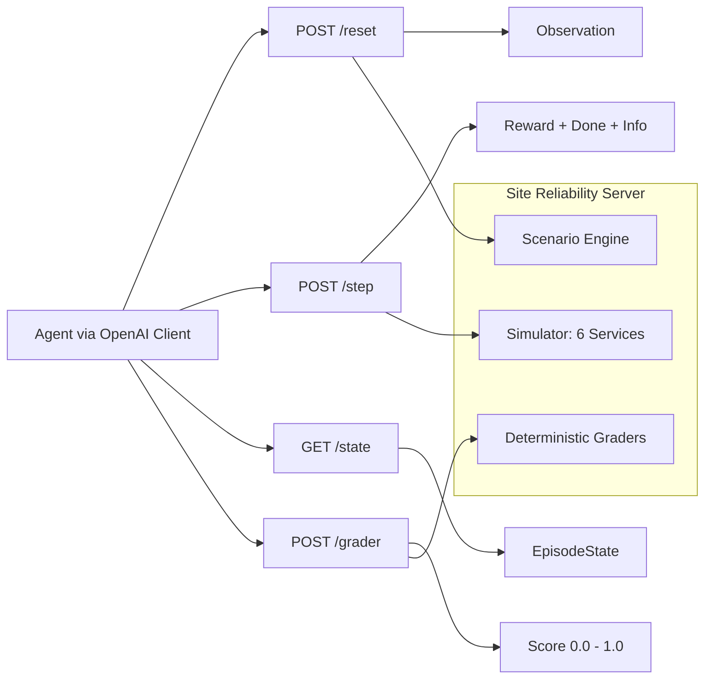
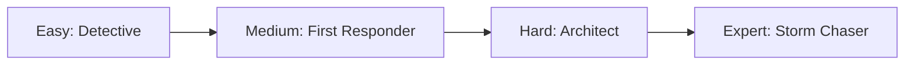
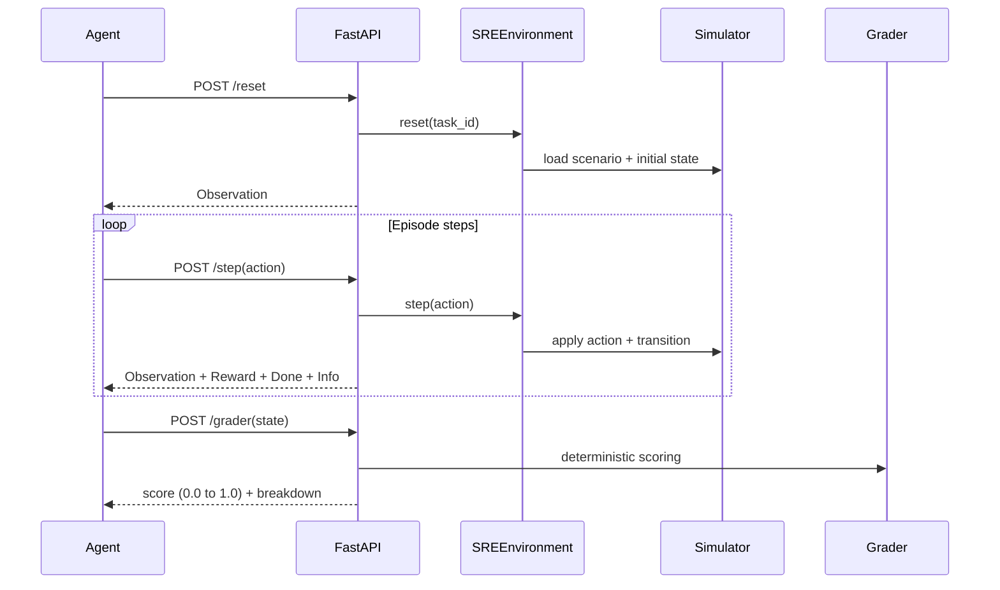

# Site Reliability Server (OpenEnv)

Production-style SRE incident-response environment for training and evaluating AI agents with the standard OpenEnv loop:
`reset()` -> `step(action)` -> `state()`.

This benchmark mirrors practical on-call operations used in real engineering teams: triaging alerts,
isolating root causes across service dependencies, and applying safe remediations under time pressure.
It is useful for evaluating whether an agent can improve reliability outcomes instead of only solving abstract tasks.

## Project Highlights

- Real-world utility: production-style SRE incident diagnosis and remediation across dependent microservices.
- OpenEnv compliance: typed Observation/Action/Reward models with `reset`, `step`, `state`, and `openenv.yaml`.
- Task quality: 4 progressive tasks (`easy`, `medium`, `hard`, `expert`) with deterministic programmatic graders.
- Learning quality: dense reward signal with progress terms and penalties for low-value behavior.
- Deployment readiness: works with Docker, Hugging Face Spaces, and OpenEnv validation.
- Infra fit: designed for `vcpu=2`, `memory=8gb`, with inference timeout bounded below 20 minutes.

## Why This Matters

- Real-world domain: incident diagnosis and remediation in microservice systems.
- Not a toy: actions have side effects, trade-offs, and partial credit.
- Benchmark value: deterministic graders with clear difficulty progression.

## Visual Overview





## Capability Matrix

| Area | Implementation |
|---|---|
| Environment API | FastAPI with `POST /reset`, `POST /step`, `GET /state` |
| Typed models | Pydantic models for Observation, Action, Reward, EpisodeState |
| Tasks | 4 tasks with increasing difficulty and step budgets |
| Grading | Deterministic graders returning numeric `0.0-1.0` scores |
| Rewards | Dense, per-step shaping with positive progress and penalties |
| Baseline | Root-level `inference.py` using OpenAI client + env vars |
| Packaging | Dockerfile + `openenv.yaml` + local OpenEnv validation |
| Deployment | HF Space-compatible containerized runtime |

## Engineering Quality Snapshot

- Typed models and strict API contract for predictable agent interaction.
- Deterministic scenario + grader pipeline for fair task-level scoring.
- Containerized deployment that starts cleanly and serves health/reset/step/state/grader paths.
- Baseline inference pipeline with bounded runtime and machine-readable score artifacts.

## Tasks and Difficulty

| Task | Goal | Max Steps | Grader Output |
|---|---|---:|---|
| easy | Identify root-cause service | 15 | 0.0 to 1.0 |
| medium | Recover all key health metrics | 15 | 0.0 to 1.0 |
| hard | Fix hidden config regression | 20 | 0.0 to 1.0 |
| expert | Resolve multi-cause cascade | 25 | 0.0 to 1.0 |

### What Makes Each Task Hard

- easy: requires causal root-cause reasoning, not random restarts.
- medium: requires balancing multiple metrics, not optimizing only one.
- hard: requires config-level diagnosis from deploy/config context.
- expert: requires ordered recovery under cascading multi-service failure.

## Observation and Action Spaces

### Observation (typed)
- `step`, `max_steps`, `task_id`
- `metrics` (cpu, memory, error_rate, latency)
- `logs`, `deploy_history`, `current_config`
- `service_graph`, `active_alerts`, `health_summary`

### Action (typed)
- `action_type`: CHECK_LOGS, INSPECT_SERVICE, RESTART_SERVICE, SCALE_UP, SCALE_DOWN, ROLLBACK, UPDATE_CONFIG, SILENCE_ALERT
- `target_service`: one of six services
- `config_key`, `config_value` (for UPDATE_CONFIG)
- `reason`

### Space Summary

| Type | Core Fields | Purpose |
|---|---|---|
| Observation | metrics, logs, deploy_history, config, alerts, graph | Gives full operational context per step |
| Action | action_type, target_service, optional config edits | Encodes one remediation decision per step |
| Reward | step_reward, cumulative, breakdown | Explains why an action helped or hurt |

## Reward Design (Meaningful, Non-Sparse)

Per-step signal combines:
- health improvement (primary)
- latency improvement
- cost-awareness
- penalties for invalid/repeated low-value actions

This gives dense learning feedback instead of only end-of-episode binary success.

## Quick Start

```bash
# 1) Install
pip install -r requirements.txt

# 2) Generate scenarios
python env/data_generator.py

# 3) Set required vars
export OPENAI_API_KEY=<your_key>
export API_BASE_URL=https://api.groq.com/openai/v1
export MODEL_NAME=llama-3.3-70b-versatile
export HF_TOKEN=<your_hf_token>

# 4) Run server
uvicorn main:app --host 0.0.0.0 --port 7860

# 5) Run baseline
python inference.py --output-json
```

## API Endpoints

- `POST /reset`
- `POST /step`
- `GET /state`
- `GET /tasks`
- `POST /grader`
- `POST /baseline`
- `GET /health`

## Baseline Notes

- Uses OpenAI client only.
- Reads `OPENAI_API_KEY`, `API_BASE_URL`, `MODEL_NAME`, `HF_TOKEN` from environment.
- `MODEL_NAME` is configurable; examples in this README use `llama-3.3-70b-versatile` as the recommended default.
- Enforced runtime limit < 20 minutes (script timeout set to 19 minutes).
- Output written to `baseline_scores.json`.
- Reproducibility is designed to be stable with bounded variance (not necessarily bit-identical across every run due to LLM infra variability).

## Infra Constraints

Designed for low-resource evaluation:
- `vcpu=2`, `memory=8gb`
- Pure in-memory simulation
- No external DB required

## Docker

```bash
docker build -t site-reliability-server .
docker run -p 7860:7860 site-reliability-server
curl http://localhost:7860/health
```

## Validation Commands

```bash
# HF ping
curl -s -o /dev/null -w '%{http_code}' -X POST \
  -H 'Content-Type: application/json' -d '{}' \
  https://siddheshkadane-cloud-chaos-sre.hf.space/reset

# Docker build
docker build .

# OpenEnv validate (venv path-safe)
/Users/siddhesh/Documents/Projects/Cloud-Chaos-SRE/.venv/bin/openenv validate
```

These checks verify environment reachability, container buildability, and OpenEnv compliance.

## Project Structure

```text
site-reliability-server/
├── main.py, inference.py, openenv.yaml, Dockerfile, requirements.txt
├── readme.md, instruction.md, pyproject.toml, uv.lock, test_env.py
├── env/                        # core environment logic
│   ├── models.py, environment.py, simulator.py
│   ├── graders.py, tasks.py, data_generator.py
│   └── __init__.py
├── scenarios/                  # task datasets
│   ├── easy/, medium/, hard/, expert/
├── static/                     # web landing page
│   └── index.html
└── server/                     # compatibility entrypoint
    ├── app.py
    └── __init__.py
```

### Core Runtime Flow


